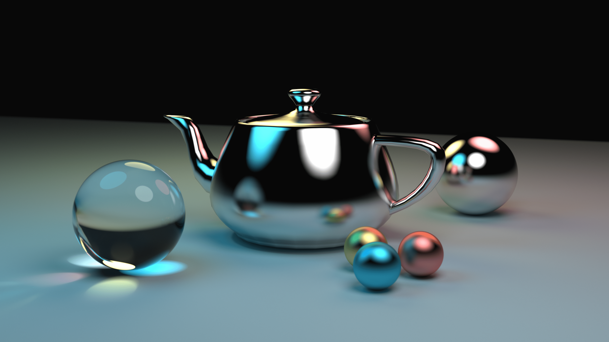
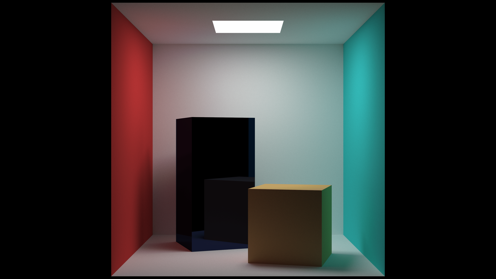
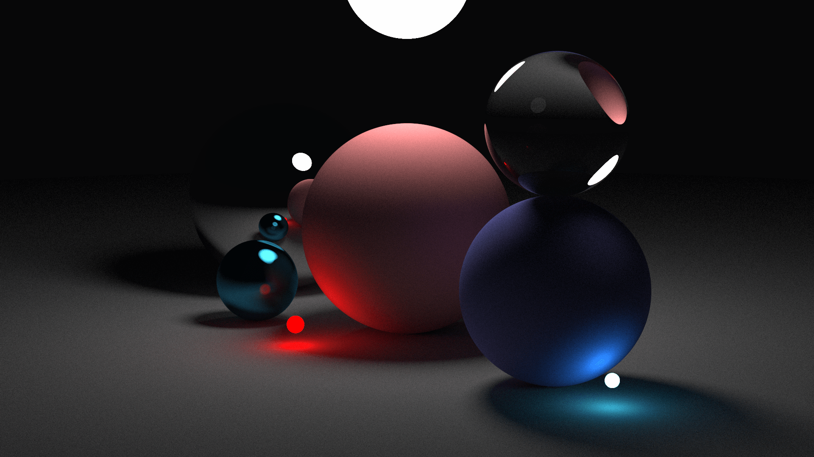
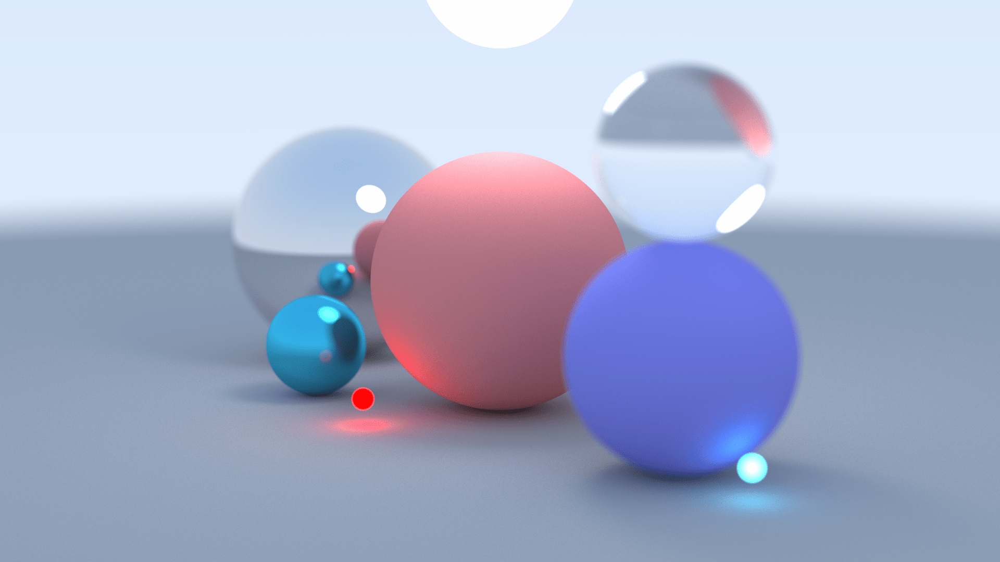
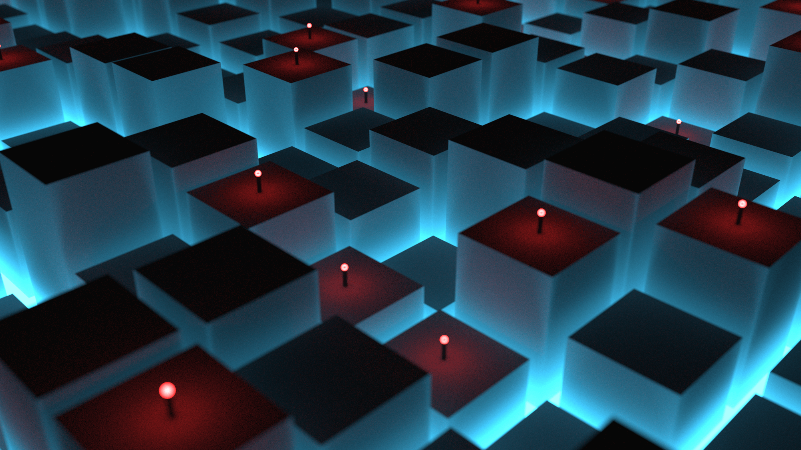
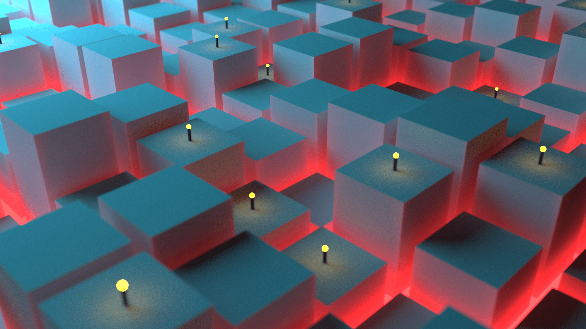
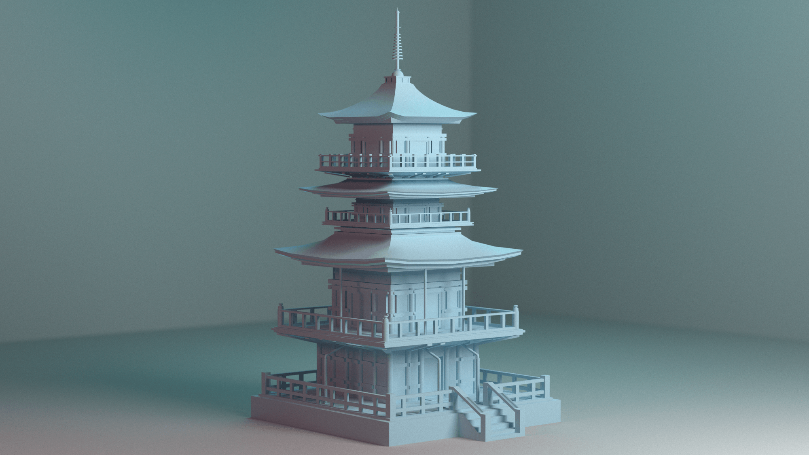

# raytracer.rs

raytracer.rs is a raytracer written from scratch for fun (renders below!).  

It combines somewhat fast and optimized ray intersections and BVH accelerated objects with an extremely slow method of simulating lights and visual clarity using a very high sample rate per pixel, which results in it taking around 10-30 hours per 4k render. This project is my first foray into learning both low level graphics and rust and I enjoyed it quite a bit!

Features:
- Implemented Objects:
    - Spheres
    - Triangle meshes
- Implemented Materials:
    - Lambertian Diffuse
    - Metal
    - Dielectric
    - Emissive
- Perspective camera with Depth of Field
- Acceleration structure: Bounding volume hierarchy(BVH) + Surface area heuristics(SAH)
- basic `.obj` parser and mesh loader
- `Vec3` and `Matrix4` implementations + object transforms
- optional multicore support via `rayon`

Helpful resources:
- https://raytracing.github.io/
- https://www.scratchapixel.com/
- https://www.pbr-book.org/
- https://www.realtimerendering.com/raytracing.html

Renders:

